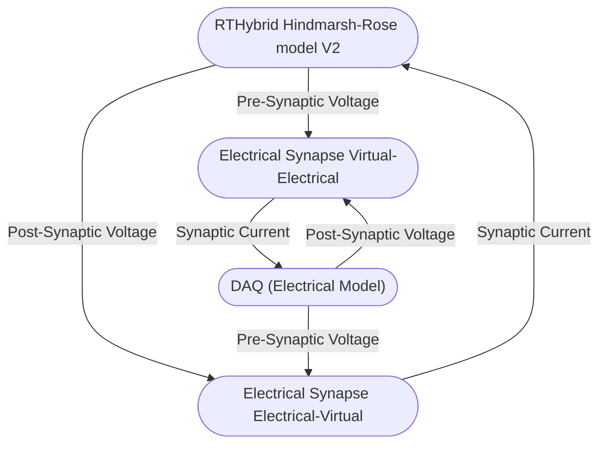
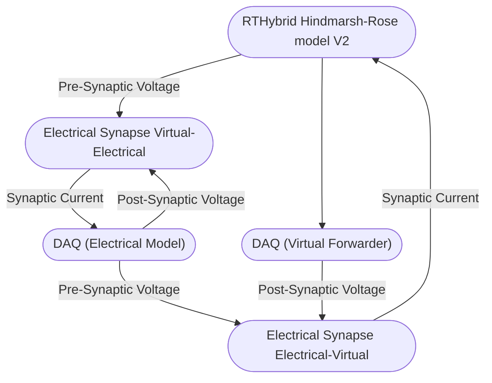
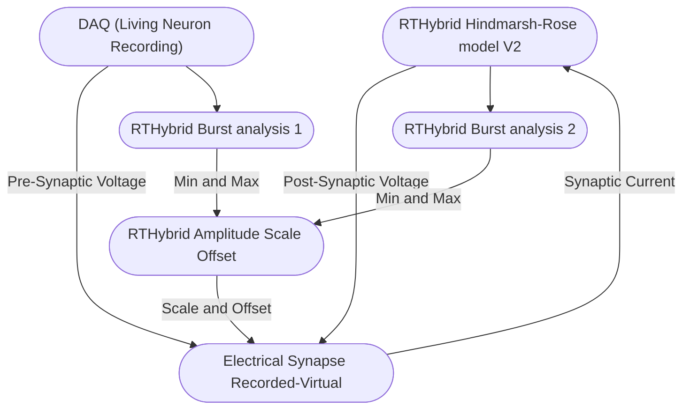

# RTXI circuits data

Here is contained all the different circuits that where recorded and connected with *RTXI*. The plugins used are the ported version of [rthybrid-for-rtxi](https://github.com/GNB-UAM/rthybrid-for-rtxi) to *RTXI V3*, they can be found [here](https://github.com/sergiohidalgo818/rthybrid-for-rtxi/tree/rthybrid-for-rtxi3/rtxi3).

## Virtual Hindmarsh-Rose in bidirectional synapse with electronic Hindmarsh-Rose

- Name of directory: `v_hr-e_hr`

### Plugin Parameters

**Control Panel:** 
  - Frequecy/Period: $10KHz$/$100\mu s$
  - Analog Scale: $250 \mu V/V$

**RTHybrid Hindmarsh-Rose model V2:**
  - Burst duration (s): 1
  - I: 3
  - a: 1
  - b: 3
  - c: 1
  - d: 5
  - r: 0.0021
  - s: 4
  - xr: -1.6
  - Vh: 1.07
  - x0: -0.712841
  - y0: -1.93688
  - z0: 3.16568

**RTHybrid Electrical Synapse 1:**
  - Phase g: 0.09
  - Antiphase g: -0.07

**RTHybrid Electrical Synapse 2:**
  - Phase g: 0.09
  - Antiphase g: -0.07

### Plugin Connection

Virtual is the RTHybrid model plugin and electrical is the physical electrical model.

---

## Virtual Hindmarsh-Rose in bidirectional synapse with electronic Hindmarsh-Rose forwarded in DAQ

- Name of directory: `v_hr-e_hr-daq_forwarding`

**Control Panel:** 
  - Frequecy/Period: $10KHz$/$100\mu s$
  - Analog Scale: $250 \mu V/V$

**RTHybrid Hindmarsh-Rose model V2:**
  - Burst duration (s): 0.9
  - I: 3
  - a: 1
  - b: 3.02
  - c: 1
  - d: 5
  - r: 0.0099
  - s: 4
  - xr: -1.78
  - Vh: 1
  - x0: -0.712841
  - y0: -1.93688
  - z0: 3.16568

**RTHybrid Electrical Synapse 1:**
  - Phase g: 1.2
  - Antiphase g: -0.5

**RTHybrid Electrical Synapse 2:**
  - Phase g: 0.12
  - Antiphase g: -0.04

### Plugin Connection

Virtual is the RTHybrid model plugin and electrical is the physical electrical model.

---

## Virtual Hindmarsh-Rose in monodirectional synapse with LP cell recording

- Name of directory: `v_hr-r_lp`

**Control Panel:** 
  - Frequecy/Period: $10KHz$/$100\mu s$

**RTHybrid Hindmarsh-Rose model V2:**
  - Burst duration (s): 1
  - I: 3
  - a: 1
  - b: 3
  - c: 1
  - d: 5
  - r: 0.00479
  - s: 4
  - xr: -1.6
  - Vh: 1
  - x0: -0.712841
  - y0: -1.93688
  - z0: 3.16568

**RTHybrid Electrical Synapse:**
  - Phase g: 0.35
  - Antiphase g: -0.55

### Plugin Connection

Virtual is the RTHybrid model plugin and electrical is the physical electrical model.

